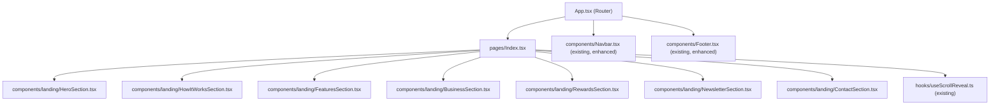

# Design Document: Charge Nest Landing Page

## Overview

The Charge Nest landing page is a single-page marketing UI built with React + Vite + TypeScript + TailwindCSS. It targets two audiences: device users who need to charge their phones/devices, and potential hosts (cafes, shops, homeowners) who can share a charging plug. The page is UI-only with no backend integration — all interactions are purely client-side.

The design builds on the existing codebase's established patterns: the `useScrollReveal` hook, the `.reveal` / `.glass` CSS utility classes, the Space Grotesk + Inter font pairing, and the existing Tailwind theme variables (primary blue, ev-green, navy, soft-gray).

The landing page will be composed as a single scrollable page rendered at the root route (`/`), replacing or augmenting the existing `src/pages/Index.tsx`. Each logical section is its own React component under `src/components/`.

---

## Architecture

The landing page follows a flat component composition model — no routing, no state management library, no data fetching. The `Index.tsx` page component imports and renders each section in order.



**Key architectural decisions:**

- Each section is a self-contained component with no props required (all data is co-located as constants).
- The existing `useScrollReveal` hook is called once in `Index.tsx` and applies to all `.reveal` elements across all sections.
- Newsletter and Contact form state is managed locally with `useState` inside each section component — no global state needed.
- The existing `Navbar.tsx` already implements the glassmorphism scroll behavior and mobile drawer; it satisfies Requirement 1 with minor label adjustments.
- The existing `Footer.tsx` will be reviewed and enhanced to satisfy Requirement 9.

---

## Components and Interfaces

### Existing Components (used as-is or with minor updates)

| Component | File | Notes |
|---|---|---|
| Navbar | `src/components/Navbar.tsx` | Already implements scroll-based glassmorphism, mobile drawer, Login/Sign Up buttons. Nav link labels need to match spec: Home, Find Spot, Share Plug, Rewards, Contact. |
| Footer | `src/components/Footer.tsx` | Needs verification of 3 link columns, 3 social icons, copyright year. |
| useScrollReveal | `src/hooks/useScrollReveal.ts` | Already implements IntersectionObserver-based reveal. Used as-is. |

### New Section Components

All new components live under `src/components/landing/`.

#### `HeroSection.tsx`
- Renders the full-viewport hero with headline, subtext, two CTAs, and a decorative illustration.
- Uses `animate-slide-up` CSS class (already defined in `index.css`) for entrance animation.
- Animated blobs use `animate-blob` / `animate-blob-delayed` (already defined).
- No props. All copy is co-located as constants.

**Interface:**
```ts
// No props — self-contained
const HeroSection: React.FC = () => { ... }
```

#### `HowItWorksSection.tsx`
- Renders 3 step cards in a horizontal row (desktop) / vertical stack (mobile).
- Each card has a numbered badge, icon, title, and description.
- Cards use `.reveal` class for scroll-triggered animation with staggered `transitionDelay`.
- Hover effect: `hover:-translate-y-2 hover:shadow-xl transition-all`.
- Cards use glassmorphism: `glass` utility class.

**Step data shape:**
```ts
interface Step {
  number: number;
  icon: LucideIcon;
  title: string;
  description: string;
}
```

#### `FeaturesSection.tsx`
- Renders 4 feature cards in a 2-col (tablet) / 4-col (desktop) grid.
- Each card: icon, title, description.
- Cards use `.reveal` with staggered delay.
- Hover: border highlight + subtle background shift via Tailwind `hover:border-primary hover:bg-primary/5`.

**Feature data shape:**
```ts
interface Feature {
  icon: LucideIcon;
  title: string;
  description: string;
}
```

#### `BusinessSection.tsx`
- Targets cafe/shop owners with a headline, 3+ benefit items, and a "List Your Spot" CTA.
- Uses a visually distinct background: `gradient-hero` or a dark navy gradient.
- Content uses `.reveal` for scroll animation.

#### `RewardsSection.tsx`
- Displays headline, description, 3 reward tiers (Bronze / Silver / Gold), and a leaderboard preview.
- Uses amber/gold accent colors: `text-amber-400`, `text-yellow-500`.
- Leaderboard preview is a static ranked list of mock entries.
- Content uses `.reveal` for scroll animation.

**Reward tier shape:**
```ts
interface RewardTier {
  name: string;       // "Bronze" | "Silver" | "Gold"
  icon: string;       // emoji or LucideIcon
  points: number;     // minimum points threshold
  benefits: string[];
  color: string;      // Tailwind color class
}
```

#### `NewsletterSection.tsx`
- Email input + "Notify Me" button.
- Local state: `email: string`, `submitted: boolean`, `error: string`.
- On submit: validates non-empty email, sets `submitted = true`, changes button text to "You're on the list!".
- No backend call.
- Uses a visually distinct background (gradient or accent band).

**Local state:**
```ts
const [email, setEmail] = useState('');
const [submitted, setSubmitted] = useState(false);
const [error, setError] = useState('');
```

#### `ContactSection.tsx`
- Form fields: Name, Email, Subject, Message.
- "Send Message" button.
- Local state: `fields`, `submitted: boolean`.
- On submit: sets `submitted = true`, shows confirmation message. No backend call.
- Form rendered in a `glass`-styled card.
- Contact info (email placeholder, location placeholder) shown alongside on desktop.

**Local state:**
```ts
interface ContactFields {
  name: string;
  email: string;
  subject: string;
  message: string;
}
const [fields, setFields] = useState<ContactFields>({ ... });
const [submitted, setSubmitted] = useState(false);
```

---

## Data Models

Since this is a UI-only landing page, there are no persistent data models. All section content is static and co-located within each component as typed constants.

### NewsletterSignup (UI state only)
```ts
interface NewsletterState {
  email: string;
  submitted: boolean;
  error: string;
}
```

### ContactFormState (UI state only)
```ts
interface ContactFormState {
  name: string;
  email: string;
  subject: string;
  message: string;
  submitted: boolean;
}
```

### RewardTier (static display data)
```ts
interface RewardTier {
  name: string;
  minPoints: number;
  benefits: string[];
  colorClass: string;   // e.g. "text-amber-600"
  bgClass: string;      // e.g. "bg-amber-50"
  borderClass: string;  // e.g. "border-amber-200"
}
```

### LeaderboardEntry (static mock data)
```ts
interface LeaderboardEntry {
  rank: number;
  name: string;
  points: number;
  tier: string;
}
```

---

## Correctness Properties

*A property is a characteristic or behavior that should hold true across all valid executions of a system — essentially, a formal statement about what the system should do. Properties serve as the bridge between human-readable specifications and machine-verifiable correctness guarantees.*

### Property 1: Navbar glassmorphism activates on scroll

*For any* scroll position greater than 20px, the Navbar element should have the glassmorphism CSS classes applied; for any scroll position of 20px or less, those classes should not be present.

**Validates: Requirements 1.4, 1.5**

---

### Property 2: Mobile drawer visibility is toggled by hamburger

*For any* viewport width below 768px, the mobile drawer should be visible if and only if the hamburger button has been activated an odd number of times (i.e., toggled open).

**Validates: Requirements 1.7, 1.8**

---

### Property 3: Newsletter submission requires non-empty email

*For any* activation of the "Notify Me" button where the email input is empty or whitespace-only, the submission should be rejected and an inline validation message should be displayed, leaving the submitted state unchanged.

**Validates: Requirements 7.4, 7.5**

---

### Property 4: Newsletter confirmation state is set on valid submission

*For any* non-empty email string, activating the "Notify Me" button should transition the component to a confirmed state (button text changes to "You're on the list!") without making any network requests.

**Validates: Requirements 7.3, 7.4**

---

### Property 5: Contact form confirmation state is set on submission

*For any* activation of the "Send Message" button, the contact section should transition to a visual confirmation state without making any network requests.

**Validates: Requirements 8.4**

---

### Property 6: How It Works section contains exactly 3 step cards

*For any* render of the HowItWorksSection, the number of step cards rendered should be exactly 3.

**Validates: Requirements 3.1**

---

### Property 7: Features section contains exactly 4 feature cards

*For any* render of the FeaturesSection, the number of feature cards rendered should be exactly 4.

**Validates: Requirements 4.1**

---

### Property 8: Rewards section contains at least 3 reward tiers

*For any* render of the RewardsSection, the number of reward tier items rendered should be at least 3.

**Validates: Requirements 6.2**

---

### Property 9: Scroll reveal elements transition to visible state on intersection

*For any* element with the `.reveal` class that enters the viewport (IntersectionObserver fires), the element should have the `.revealed` class added, making it visible (opacity 1, transform none).

**Validates: Requirements 3.3, 4.3, 5.5, 6.4, 10.3**

---

## Error Handling

Since this is a UI-only page with no backend calls, error handling is limited to client-side form validation:

- **Newsletter empty email**: Display inline error message "Please enter your email address." The submit button remains active for retry.
- **Contact form**: No validation is strictly required by the spec, but the "Send Message" button should always produce a confirmation state on click (optimistic UI).
- **Missing assets**: Hero illustration and section images use `src/assets/` files that already exist in the repo. If an image fails to load, the `alt` text provides fallback context.
- **Font loading failure**: The page uses system font fallbacks (`sans-serif`) if Google Fonts fails to load, as defined in the existing CSS.

---

## Testing Strategy

### Unit Tests

Unit tests focus on specific examples, edge cases, and component rendering correctness. They should be written with Vitest + React Testing Library (already configured in the project via `vitest.config.ts` and `src/test/setup.ts`).

Key unit test targets:
- `NewsletterSection`: renders correctly, shows error on empty submit, shows confirmation on valid submit.
- `ContactSection`: renders all 4 form fields, shows confirmation on submit.
- `HowItWorksSection`: renders exactly 3 step cards.
- `FeaturesSection`: renders exactly 4 feature cards.
- `RewardsSection`: renders at least 3 reward tiers.
- `Navbar`: renders logo, nav links, and auth buttons; applies correct class on scroll.

### Property-Based Tests

Property-based tests use **fast-check** (the standard PBT library for TypeScript/JavaScript). Each test runs a minimum of 100 iterations.

Each test is tagged with a comment in the format:
`// Feature: charge-nest-landing-page, Property {N}: {property_text}`

**Property test targets:**

| Property | Test Description |
|---|---|
| Property 1 | For any scroll Y value, assert navbar class presence matches `scrollY > 20` |
| Property 2 | For any toggle count, assert drawer visibility matches `count % 2 === 1` |
| Property 3 | For any whitespace-only string as email, assert submission is rejected and error is shown |
| Property 4 | For any non-empty email string, assert submission sets confirmed state |
| Property 5 | For any form field values, assert submission sets confirmed state |
| Property 6 | Assert step card count is always exactly 3 |
| Property 7 | Assert feature card count is always exactly 4 |
| Property 8 | Assert reward tier count is always ≥ 3 |
| Property 9 | For any element with `.reveal`, assert `.revealed` is added after IntersectionObserver fires |

**PBT library installation:**
```bash
npm install --save-dev fast-check
```

**Example property test structure:**
```ts
import fc from 'fast-check';
import { render, screen, fireEvent } from '@testing-library/react';
import NewsletterSection from '@/components/landing/NewsletterSection';

// Feature: charge-nest-landing-page, Property 3: Newsletter submission requires non-empty email
test('whitespace email is rejected', () => {
  fc.assert(
    fc.property(
      fc.stringOf(fc.constantFrom(' ', '\t', '\n')).filter(s => s.length > 0),
      (whitespaceEmail) => {
        const { unmount } = render(<NewsletterSection />);
        const input = screen.getByPlaceholderText('Enter your email address');
        const button = screen.getByText('Notify Me');
        fireEvent.change(input, { target: { value: whitespaceEmail } });
        fireEvent.click(button);
        expect(screen.queryByText("You're on the list!")).toBeNull();
        unmount();
      }
    ),
    { numRuns: 100 }
  );
});
```
